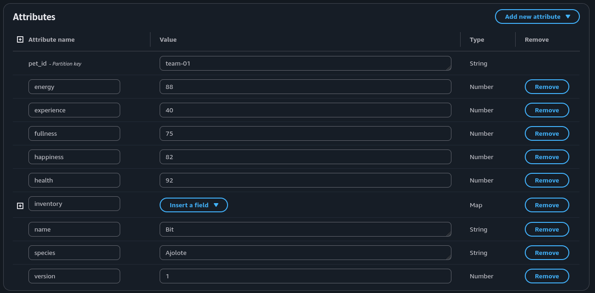
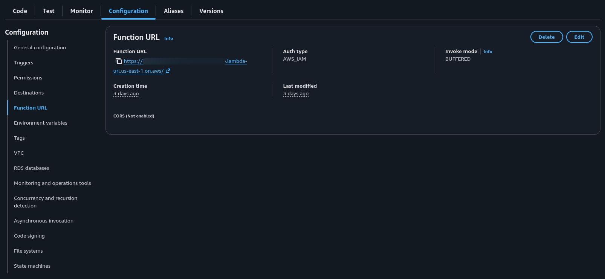
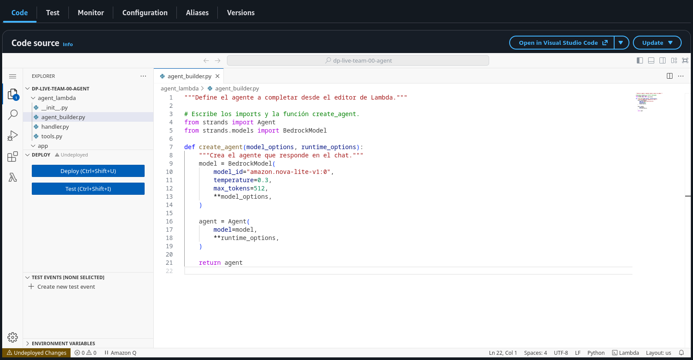
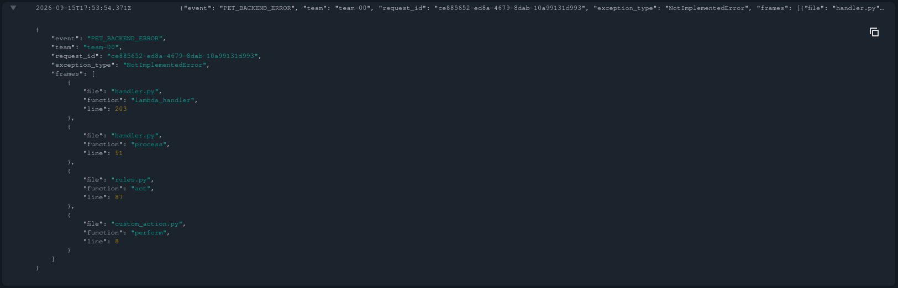

# {{eventTitle}}

Por: Bruno Ancona

{{eventDate}}

Notes:
Presenta la idea del taller. Si alguien tiene problemas para entrar, revisa la asignación de su equipo.

---

## Qué construiremos

Un agente para cuidar una mascota digital, usando Python y servicios de AWS.

- Configuración del modelo y de las instrucciones del agente.
- Herramientas para consultar y modificar datos reales.
- Recursos propios por equipo dentro de la cuenta de AWS proporcionada.

Notes:
Explica qué tendrá el proyecto al terminar. Comparte los datos de acceso por un canal privado.

---

## Tu acceso a AWS

1. Abre [sso.brunoancona.me](https://sso.brunoancona.me).
2. Inicia sesión con el usuario y la contraseña asignados a tu equipo.
3. En **AWS accounts**, selecciona la cuenta y el permiso asignados a tu equipo.
4. Selecciona **US East (N. Virginia)** (`us-east-1`) en el selector de región de la consola.

Notes:
Abre el portal SSO y muestra el login con el usuario de prueba. Evita mostrar contraseñas y confirma la región us-east-1.

---

## Follow along · Acceso

1. Abre [sso.brunoancona.me](https://sso.brunoancona.me) e inicia sesión con el usuario y la contraseña asignados.
2. En **AWS accounts**, abre la cuenta y el permiso asignados.
3. Selecciona **US East (N. Virginia)** (`us-east-1`) en la consola.
4. Abre la app del taller ([workshop.brunoancona.me](https://workshop.brunoancona.me)) en otra pestaña con el mismo usuario y confirma tu equipo.

**Antes de continuar:** debes tener acceso a la consola y a la app, con el equipo correcto.

Notes:
Comprueba que cada equipo pueda entrar a la consola y a la app. Usa un solo chat activo por equipo.

---

<!-- divider -->
## 01 / Una conversación

Notes:
Presenta la primera práctica. Vamos a conversar con un modelo desde Bedrock.

---

## Modelo, prompt y chatbot

- Un **modelo de lenguaje** genera texto a partir de las instrucciones y el contexto que recibe.
- El **prompt** es la entrada con la que indicamos la tarea y aportamos contexto al modelo.
- Un **chatbot** es una aplicación que permite interactuar mediante una conversación.

Notes:
Un chatbot permite conversar con una aplicación. Puede usar reglas o un agente. El modelo necesita una conexión para consultar nuestros datos.

---

<!-- service -->
## Amazon Bedrock


Amazon Bedrock es un servicio administrado de AWS que permite integrar modelos de IA generativa en nuestras aplicaciones.

- AWS administra la infraestructura que ejecuta los modelos.
- En este taller utilizaremos **Amazon Nova Lite**.
- El **playground** permite probar el modelo desde la consola.

Notes:
Muestra el playground. Bedrock es el servicio y Nova Lite es el modelo. Strands será el SDK para construir el agente.

---

## Follow along · Bedrock

1. Abre el playground de chat de Amazon Bedrock.
2. Selecciona **Amazon Nova Lite**.
3. Prueba los mensajes de las siguientes diapositivas.

**Objetivo:** observar qué puede responder el modelo sin acceso a nuestra base de datos.

Notes:
Muestra cómo abrir el playground y elegir el modelo. Después deja los prompts visibles para que los equipos los prueben.

---

## Una conversación en Bedrock

> Eres una mascota digital que aprende programación. Preséntate en español y propón un reto sencillo.

Observa cómo las instrucciones del prompt influyen en el tono y el contenido de la respuesta.

Notes:
Pregunta qué tono esperan de la respuesta. Envía el prompt y compara lo que respondió el modelo.

---

## Limitaciones del chatbot

> ¿Cuánta energía tiene mi mascota ahora? ¿Puedes consultar mi tabla DynamoDB?

Mencionar DynamoDB en el mensaje no conecta la tabla al modelo.

- El modelo puede responder sin haber consultado ningún dato.
- Una respuesta convincente no demuestra que haya leído la tabla.

Notes:
El playground todavía no tiene una tool para leer la mascota. Si el modelo dice que no puede consultar los datos, esa respuesta también sirve para mostrar la limitación.

---

## Un agente con herramientas

Un agente utiliza un modelo para elegir acciones y sus resultados para avanzar en una tarea.

- Las **tools** son funciones para consultar datos o realizar acciones.
- Nuestro agente consultará la energía y solicitará cuidados.
- El código validará las acciones antes de modificar el estado.

Un chatbot puede integrar un agente: el chat permite conversar y el agente coordina las acciones.

Notes:
Pregunta qué falta para consultar la energía real. El modelo pide usar una tool y el código la ejecuta. Las reglas y los permisos controlan lo que puede hacer.

---

<!-- divider -->
## 02 / Una mascota real

Notes:
Presenta la mascota y los datos que vamos a guardar. Esos datos serán el estado real que consultará el agente.

---

<!-- service -->
## Amazon DynamoDB


DynamoDB es una base de datos NoSQL administrada por AWS que guarda datos en tablas.

- Un **item** es un registro, como tu mascota.
- Sus **atributos** son campos como `name` y `energy`.
- `pet_id` permite encontrar la mascota de tu equipo.
- Los datos siguen ahí aunque cierres el chat.

Notes:
Muestra la tabla, el item y sus atributos. La app lee de aquí el estado de la mascota.

---

## Follow along · Adopta tu mascota

1. Abre el item de tu equipo en DynamoDB.
2. Edita únicamente `name` y `species` y guarda los cambios.
3. Actualiza la ficha en la app.

**Resultado esperado:** la ficha muestra el nombre y la especie elegidos.

Notes:
Confirma que el pet_id sea el del equipo. Edita solo name y species. Conserva las estadísticas, el inventario y la versión.

---

<!-- capture -->
## Tu mascota en DynamoDB



Edita solo `name` y `species`: Dragón, Gato, Zorro o Ajolote.

Notes:
Pregunta qué pasará al actualizar la ficha. Guarda el nombre y la especie, vuelve a la app y comprueba el cambio. Los valores de la captura son un ejemplo.

---

<!-- diagram -->
## Lo que construiremos

<svg viewBox="0 0 1620 620" role="img" aria-label="El navegador usa la app compartida, la app invoca la función Lambda del agente mediante su Function URL, el agente consulta Bedrock y llama a la función Lambda de la mascota, que valida reglas y guarda en DynamoDB; la ficha tiene una consulta independiente y las funciones Lambda envían logs a CloudWatch.">
<defs><marker id="arrow" markerWidth="10" markerHeight="10" refX="8" refY="3" orient="auto-start-reverse"><path d="M0,0 L8,3 L0,6" fill="#7040a0"/></marker></defs>
<image href="assets/icons/bedrock.svg" x="602" y="60" width="64" height="64"/>
<image href="assets/icons/lambda.svg" x="928" y="165" width="64" height="64"/>
<image href="assets/icons/lambda.svg" x="1198" y="165" width="64" height="64"/>
<image href="assets/icons/dynamodb.svg" x="1488" y="165" width="64" height="64"/>
<image href="assets/icons/cloudwatch.svg" x="930" y="570" width="48" height="48"/>
<g fill="none" stroke="#7040a0" stroke-width="4" marker-end="url(#arrow)">
<path d="M230 290H310"/><path d="M570 290H690"/><path d="M1010 290H1100"/><path d="M1360 290H1420"/>
<path d="M850 240V150" marker-start="url(#arrow)"/>
<path d="M440 350V440H1230V350" stroke-dasharray="12 9"/>
<path d="M850 350V555H1000" stroke="#637080"/><path d="M1360 330H1390V555H1330" stroke="#637080"/>
</g>
<g font-family="Arial,sans-serif" font-size="28" text-anchor="middle" fill="#161d26">
<rect x="0" y="240" width="230" height="110" rx="10" fill="#edf0f3"/><text x="115" y="305">Tu navegador</text>
<rect x="310" y="240" width="260" height="110" rx="10" fill="#edf0f3"/><text x="440" y="285">App compartida</text><text x="440" y="320" font-size="24">Chat + ficha</text>
<rect x="690" y="240" width="320" height="110" rx="10" fill="#dbc5ff"/><text x="850" y="285">Lambda agente</text><text x="850" y="320" font-size="24">Tu Agent de Strands</text>
<rect x="690" y="35" width="320" height="115" rx="10" fill="#dbc5ff"/><text x="850" y="80">Amazon Bedrock</text><text x="850" y="117" font-size="24">Nova Lite</text>
<rect x="1100" y="240" width="260" height="110" rx="10" fill="#ffe2b3"/><text x="1230" y="285">Lambda mascota</text><text x="1230" y="320" font-size="24">Reglas + tu acción</text>
<rect x="1420" y="240" width="200" height="110" rx="10" fill="#edf0f3"/><text x="1520" y="305">DynamoDB</text>
<rect x="1000" y="510" width="330" height="85" rx="10" fill="#edf0f3"/><text x="1165" y="562">CloudWatch · logs</text>
<text x="640" y="205" font-size="23">Function URL</text><text x="640" y="230" font-size="21">acceso autorizado</text>
<text x="650" y="485" font-size="25">Lectura de la ficha</text>
</g></svg>

Escribiremos el agente, su prompt y una acción. Los helpers ya están preparados.

Notes:
Recorre el diagrama. Señala que la ficha lee DynamoDB por separado. Pregunta si cambiar el nombre en la tabla hace que el modelo lo conozca.

---

<!-- divider -->
## 03 / Tu primer agente

Notes:
Presenta la parte de código. Los recursos de AWS ya están preparados para empezar.

---

<!-- service -->
## AWS Lambda


AWS Lambda ofrece **Function as a Service (FaaS)**: ejecuta tu código ante eventos sin que administres servidores.

- La **función del agente** responde a los mensajes.
- La **función de la mascota** valida las acciones y guarda los cambios.
- **Deploy** aplica los cambios que hiciste en el editor.

Notes:
Muestra el editor y el botón Deploy. Lambda ejecuta el código al recibir un evento. Los permisos y el handler ya están preparados.

---

## La app ya está preparada

<div class="prepared-services"></div>

- **EC2** ofrece servidores virtuales y aloja nuestra app.
- **Cognito** gestiona el login de la app con tu identidad del taller.
- La **Function URL** es la dirección HTTP de tu función Lambda del agente.

La app verifica tu identidad y permite conectar únicamente el agente de tu equipo.

Notes:
La app usa el mismo usuario del equipo. Solo acepta la Function URL del agente asignado. El servidor se encarga de autenticar las llamadas.

---

<!-- capture -->
## La Function URL del agente

En la función del agente: **Configuration → Function URL**.

<div class="capture-window capture-url"></div>

Copia la dirección con el ícono junto a la URL y pégala en la app.

Notes:
Confirma que sea la función del agente. Copia la URL con el botón y pégala en la app. Conserva la configuración de autenticación.

---

## Follow along · Conecta y escribe

1. Copia la Function URL de tu función Lambda del agente y conéctala en la app.
2. Abre `agent_builder.py` en el editor de la función Lambda del agente.
3. Sigue los bloques de código de las siguientes diapositivas.

**Antes del deploy:** completa la función que construye el agente.

Notes:
Conecta la Function URL y abre agent_builder.py. Este es el archivo que vamos a editar; conserva el handler.

---

## Strands: el SDK del agente


Strands es un SDK: un conjunto de clases y funciones para construir agentes desde Python.

- `BedrockModel` configura la conexión con el modelo de Amazon Bedrock.
- `Agent` utiliza ese modelo para atender nuestros mensajes.

Comenzaremos creando el agente y definiendo cómo debe responder.

Notes:
Strands aporta las clases para crear el agente. Distingue el SDK del modelo y del servicio Bedrock.

---

## Los imports

```python
from strands import Agent
from strands.models import BedrockModel
```

- `import` permite utilizar clases o funciones de otro módulo.
- `Agent` es la clase con la que creamos el agente.
- `BedrockModel` conecta el agente con un modelo en Bedrock.

Notes:
Escribe los imports al principio de agent_builder.py. Después añade create_agent y completa su cuerpo antes de probar.

---

## La función que construye el agente

```python
def create_agent(model_options, runtime_options):
    """Crea el agente que responde en el chat."""
```

- `create_agent` devuelve el agente al código que atiende el chat.
- `model_options` contiene la sesión de AWS y las opciones de conexión.
- `runtime_options` contiene las opciones de ejecución ya preparadas.

Dentro escribiremos el modelo y `Agent(...)` con la misma indentación.

Notes:
Explica los dos parámetros. model_options contiene la conexión a AWS y runtime_options las opciones de ejecución del taller.

---

## El modelo

```python
model = BedrockModel(
    model_id="amazon.nova-lite-v1:0",
    temperature=0.3,
    max_tokens=512,
    **model_options,
)
```

- `model_id` selecciona Nova Lite.
- `temperature` ajusta qué tan variadas pueden ser las respuestas.
- `max_tokens` limita la salida en tokens, fragmentos de texto que procesa el modelo.

Notes:
Este bloque va dentro de create_agent. temperature controla cuánto puede variar la respuesta y max_tokens limita la salida de cada llamada. Conserva model_options.

---

## Crear el agente

```python
agent = Agent(
    model=model,
    **runtime_options,
)

return agent
```

- `model=model` le pasa el modelo que acabamos de configurar.
- `**runtime_options` incorpora las opciones de ejecución preparadas.

Notes:
Crea el agente con el modelo y devuelve el objeto con return agent. Conserva runtime_options. Las tools se agregan en el siguiente bloque.

---

<!-- capture -->
## El agente en el editor de Lambda



`agent_builder.py` contiene el agente. **Deploy** publica los cambios.

Notes:
Muestra agent_builder.py en el árbol de archivos y el botón Deploy. Comprueba que la función incluya el modelo, Agent y return agent.

---

<!-- compact -->
## Follow along · Primer chat

1. Completa `create_agent` y pulsa **Deploy**.
2. Envía este mensaje desde el chat de la app.

> ¿Cómo está mi mascota?

3. Guarda la respuesta para compararla después.

**Antes de continuar**, ¿qué contexto le falta al agente?

Notes:
Prueba el chat antes de añadir el system prompt. El agente puede dar consejos generales o pedir más contexto. Guarda la respuesta para compararla después.

---

## Tu system prompt

El **system prompt** define el papel y las instrucciones del agente.

```python
system_prompt = """Eres el cuidador de mi mascota digital.
Habla en español, breve y con humor.
No inventes su estado si no puedes consultarlo."""
```

Dentro de `Agent(...)`: `system_prompt=system_prompt`

Escribe tu propia versión: quién es, cómo habla y cuándo debe consultar datos.

Notes:
Cada equipo escribe su system prompt y lo agrega a Agent. Explica qué papel tendrá el agente y cómo debe responder.

---

## Follow along · Personalidad

1. Escribe tu system prompt y pásalo a `Agent(...)`.
2. Pulsa **Deploy** y repite "¿Cómo está mi mascota?".
3. Compara el papel y el tono del agente con su primera respuesta.

**Resultado esperado:** el agente responde siguiendo las instrucciones que escribiste.

Notes:
Repite la misma pregunta y compara el tono y el contenido. El prompt cambia las instrucciones, pero todavía falta conectar los datos.

---

<!-- divider -->
## 04 / Una consulta real

Notes:
Primero vamos a probar una consulta desde Lambda. Después la conectaremos al agente como una tool.

---

## Cómo consultar el estado real

El agente ya tiene instrucciones, pero todavía no puede consultar nuestra mascota.

- Necesita una función que lea su estado en DynamoDB.
- Esa función será una **herramienta (tool)** disponible para el agente.
- El modelo podrá solicitarla y usar los datos que devuelva para responder.

Vamos a revisar esa función antes de conectarla.

Notes:
Retoma la pregunta por la energía real. El prompt por sí solo no conecta DynamoDB. La tool le dará al modelo los datos para responder.

---

<!-- compact -->
## Follow along · Testing en Lambda

1. Abre **Test** en la función Lambda de la **mascota**.
2. Crea un evento de prueba con este JSON.

```json
{"pet_id": "team-01", "action": "inspect", "parameters": {}}
```

3. Usa tu ID en lugar de `team-01` y pulsa **Test**.

**Resultado esperado:** el estado coincide con los datos en DynamoDB.

Notes:
Usa Test en la función de la mascota. El evento pide inspect directamente. Revisa success y compara el resultado con DynamoDB.

---

## Así se ve una tool

```python
from strands import tool
from strands.types.tools import ToolContext

@tool(context=True)
def inspect_pet(tool_context: ToolContext) -> dict:
    """Lee el estado real de tu mascota sin cambiarlo."""

    return gateway_for(tool_context).execute("inspect_pet")
```

- `@tool` permite ofrecer la función al modelo.
- El docstring explica su propósito y `return` devuelve los datos.
- `gateway_for(...)` conecta con la función Lambda que acabamos de probar.

Notes:
Abre inspect_pet en tools.py. El docstring explica qué hace. gateway_for conecta con la función de la mascota y Strands proporciona tool_context.

---

## Importar y registrar

```python
from agent_lambda.tools import inspect_pet
```

```python
tools=[inspect_pet],
```

- El import va arriba del archivo y permite usar la función.
- La lista `tools` va dentro de `Agent(...)` y la ofrece al modelo.

Notes:
El import va al principio del archivo y la lista tools dentro de Agent. Importar la función la deja disponible; registrarla permite que el modelo la use.

---

## Evidencia de una consulta

- **Registrada:** el agente tiene esa tool disponible para elegirla.
- **Ejecutada:** la actividad muestra una llamada a `inspect_pet`.
- **Comprobada:** los datos de la respuesta coinciden con la ficha.

Una lista de tools disponibles no prueba que el agente las haya usado.

Notes:
Busca inspect_pet en la actividad y compara los datos con DynamoDB. Si la tool no aparece, revisa el registro y el prompt.

---

## Follow along · Consulta

1. Lee `inspect_pet`, impórtala y agrégala a `tools`.
2. Pulsa **Deploy** y pregunta por el nombre y la energía.
3. Compara la respuesta con la ficha.

**Resultado esperado:** `inspect_pet` aparece en la actividad y los datos coinciden.

Notes:
Pide una consulta del estado. Confirma que aparezca inspect_pet en la actividad. La ficha visible en la app no se envía al modelo.

---

<!-- divider -->
## Break

Notes:
Haz una pausa. Antes de seguir, pregunta qué equipos necesitan ayuda.

---

<!-- divider -->
## 05 / De consultar a actuar

Notes:
Abre las reglas de cuidado en la función de la mascota. Vamos a probar rest desde Test antes de conectar care_for_pet.

---

## Las reglas de cuidado

La función Lambda de la mascota incluye las acciones `feed`, `play` y `rest`.

- `rules.py` define las condiciones y los efectos de cada acción.
- Con `rest`, la mascota recupera energía y pierde algo de saciedad.
- Si ya tiene suficiente energía, la regla rechaza el descanso.

Notes:
Busca el caso rest en rules.py. Con energía de 90 o más devuelve ALREADY_RESTED. Si acepta el descanso, suma 35 de energía y resta 10 de saciedad, dentro de los límites de 0 a 100.

---

<!-- compact -->
## Follow along · Cuidado en Lambda

1. En la función Lambda de la **mascota**, lee el caso `rest` en `rules.py`.
2. Abre **Test** y usa tu ID en este evento.

```json
{"pet_id": "team-01", "action": "rest", "parameters": {}}
```

3. Ejecuta una vez y compara la energía y la saciedad con DynamoDB.

Notes:
Anota la energía y la saciedad. Ejecuta Test una vez, revisa success y message, y actualiza el item en DynamoDB. Compara el resultado con la regla.

---

## Registra el cuidado

`care_for_pet` permite solicitar desde el agente las acciones de cuidado de la mascota.

```python
from agent_lambda.tools import inspect_pet, care_for_pet
```

Dentro de `Agent(...)`:

```python
tools=[inspect_pet, care_for_pet],
```

Notes:
Lee el docstring de care_for_pet. action elige feed, play o rest; food se usa al alimentar. Importa la tool, agrégala a tools y pide en el prompt que consulte primero y haga un cuidado por mensaje.

---

## Follow along · A jugar

1. Registra `care_for_pet` en el agente y pulsa **Deploy**.
2. Pide en el chat "Consulta el estado de mi mascota y haz que juegue una vez".
3. Revisa la actividad y compara los cambios en la ficha.

La actividad muestra `care_for_pet` con `play` y la ficha refleja los cambios.

Notes:
Pide jugar una vez. play requiere 20 de energía; el descanso anterior deja suficiente si nadie hizo otra acción. Revisa la consulta y la llamada con action="play". Compara las estadísticas y, si falla, consulta el estado antes de repetir.

---

<!-- divider -->
## 06 / Una acción tuya

Notes:
Presenta la acción propia. Primero conectaremos la tool y después escribiremos sus efectos.

---

## Tu nueva herramienta

`custom_action` conecta el agente con la acción que programarás en la función Lambda de la mascota.

```python
from agent_lambda.tools import custom_action
```

Dentro de `Agent(...)`:

```python
tools=[inspect_pet, care_for_pet, custom_action],
```

Notes:
Lee custom_action, impórtala y agrégala a tools. Pregunta si registrar la tool también completa su código. Por ahora deja perform como está.

---

## El prompt para la nueva acción

Añade estas instrucciones a tu `system_prompt`, sin borrar las anteriores:

> Cuando te pida practicar un hechizo, consulta primero el estado con inspect_pet y después usa custom_action. Ejecuta la acción una sola vez. Si la herramienta rechaza la acción, explica el motivo sin afirmar que tuvo éxito.

Adapta "practicar un hechizo" a la acción que programe tu equipo.

Notes:
Relaciona el nombre de la acción con custom_action en el prompt. Conserva las instrucciones anteriores y el argumento system_prompt. Pulsa Deploy antes de probar.

---

<!-- compact -->
## Follow along · Conecta primero

1. Importa y registra `custom_action`, ajusta el prompt y pulsa **Deploy**.
2. Solicita el hechizo una vez, sin editar todavía la función Lambda de la mascota.
3. Abre **Actividad de las herramientas** y copia el `request_id` del resultado de `custom_action`.

**Resultado esperado:** la herramienta devuelve `BACKEND_ERROR` y un ID de ejecución.

Notes:
Busca custom_action en la actividad. Copia el request_id del resultado, aunque el modelo no lo mencione en el chat. Si el equipo ya terminó la acción, muestra un ejemplo sin borrar su trabajo.

---

## Un error por investigar

`BACKEND_ERROR` indica que hubo un error al procesar la operación.

- La actividad muestra un mensaje general y el `request_id`.
- Los logs contienen el tipo de error y su ubicación en el código.
- Revisa los logs y el estado antes de repetir la acción.

Notes:
Una excepción interrumpe la ejecución del código. El handler devuelve BACKEND_ERROR con un ID para buscar el problema. Revisa el estado antes de repetir la acción.

---

<!-- service -->
## Amazon CloudWatch


CloudWatch ayuda a monitorear aplicaciones en AWS con logs, métricas y alarmas.

- Un **log** es un registro de algo que pasó en el código.
- Cada función Lambda del taller tiene un **log group** con sus logs.
- El `request_id` permite encontrar los logs de la operación que falló.

Notes:
CloudWatch permite revisar los logs y también ofrece métricas y alarmas. Aquí vamos a buscar dónde falló la función.

---

<!-- capture -->
## La evidencia en CloudWatch

El tipo de error y el último frame de la misma ejecución.

<div class="capture-window capture-error-header"></div>

<div class="capture-window capture-error-frame"></div>

- `exception_type` identifica el error.
- `frames` muestra los archivos, las funciones y las líneas de la ejecución.

Notes:
Los dos recortes muestran el mismo log. NotImplementedError indica que falta completar perform. El último frame muestra el archivo y la línea. El request_id identifica esa ejecución; es distinto del operation_id.

---

<!-- compact -->
## Follow along · CloudWatch

1. Abre los logs de la función Lambda de la mascota.
2. Busca el `request_id` que copiaste de la actividad.
3. Expande `PET_BACKEND_ERROR` y revisa `exception_type` y el último elemento de `frames`.
4. Abre el archivo y la línea indicados en el editor de Lambda.

**Resultado esperado:** localizar la implementación pendiente en `perform`.

Notes:
Busca el request_id entre comillas en los logs de la mascota. Revisa la región y la fecha si no aparece. Abre el archivo y la línea del último frame. El starter falla antes de guardar cambios.

---

<!-- divider -->
## 07 / Tu acción en Python

Notes:
Reemplaza el raise de perform por la condición y los efectos de la acción. Completa la función antes de hacer Deploy.

---

## Qué debe devolver tu función

`perform(pet)` recibe el estado actual y devuelve el resultado de tu acción.

- Si acepta: `success=True`, `changes` y `message`.
- Si rechaza: `success=False`, `reason` y `message`.
- `changes` lleva incrementos, como `energy: -10`, no el valor final.

Los helpers revisan y guardan los cambios en DynamoDB.

Notes:
Explica qué devuelve la función cuando acepta o rechaza la acción. changes usa incrementos enteros entre -35 y 35. Conserva la identidad, el inventario y la versión.

---

## Un hechizo de ejemplo

La condición evita que la mascota practique sin energía suficiente.

- Si tiene menos de 10 de energía, devuelve `NEEDS_REST`.
- Si puede practicar, resta 10 de energía y suma 20 de experiencia.
- El mensaje cuenta lo que pasó después de aplicar la regla.

Notes:
El hechizo es un ejemplo; cada equipo puede elegir otra acción. Pregunta qué pasaría con 9 de energía y revisa la condición.

---

<!-- compact -->
## Escribe la condición

En `custom_action.py` de la función Lambda de la mascota:

```python
def perform(pet):
    """Practica un hechizo si queda energía suficiente."""

    if pet["energy"] < 10:
        return {
            "success": False,
            "reason": "NEEDS_REST",
            "message": "Necesito descansar antes de practicar.",
        }
```

Notes:
Escribe la condición de rechazo. Todavía falta el resultado de éxito, así que espera a completar la función antes de hacer Deploy.

---

## Escribe los efectos

Después del `if`, dentro de `perform`:

```python
    return {
        "success": True,
        "changes": {"energy": -10, "experience": 20},
        "message": "Tu mascota practicó su hechizo.",
    }
```

`changes` pide restar 10 de energía y sumar 20 de experiencia.

Los helpers validan el cambio y lo guardan en DynamoDB.

Notes:
Completa el resultado de éxito. changes contiene los incrementos, no los valores finales. El código del taller se encarga de validarlos y guardarlos.

---

## Follow along · Programa tu acción

1. Implementa `perform(pet)` con una condición, dos efectos y un mensaje.
2. Pulsa **Deploy** en la función Lambda de la mascota.
3. Solicita la acción una vez desde el chat.

**Resultado esperado:** `custom_action` tiene éxito y aplica los efectos definidos.

Notes:
Si cambia el nombre de la acción, ajusta también el prompt y haz Deploy en el agente. Guarda el código antes de usar un checkpoint. Ante un resultado incierto, consulta el estado.

---

## Tu acción en funcionamiento

- **Deploy** actualiza el código de la función de la mascota.
- La actividad debe mostrar `custom_action` con `success: true`.
- La ficha debe reflejar los efectos que programaste.

Si no está claro qué pasó, consulta el estado antes de repetir la acción.

Notes:
Revisa custom_action y success en la actividad. Compara los efectos con los datos guardados. Si hay dudas, actualiza la ficha y consulta los logs.

---

<!-- divider -->
## Espacio para terminar

Notes:
Da espacio para terminar y ayuda a los equipos que lo necesiten. Quienes terminen pueden revisar su condición y sus efectos.

---

## Follow along · Guarda tu proyecto

1. Copia `agent_builder.py`, `custom_action.py` y el estado de tu mascota.
2. Guárdalos como archivos locales.
3. Abre las copias para comprobar su contenido.

**Antes de terminar:** conserva tu trabajo fuera de la cuenta del taller.

Notes:
Copia los archivos y comprueba que se puedan abrir. Guarda solo el código y los datos de ejemplo que quieran conservar, sin credenciales.

---

## Recap · Lo que construimos

- Configuramos un modelo en **Bedrock** y creamos el agente con **Strands**.
- Escribimos el **system prompt** y conectamos herramientas para consultar y actuar.
- Programamos una acción en **Lambda**, con cambios persistentes en **DynamoDB**.
- Localizamos un error en el código con los logs de **CloudWatch**.

El modelo elige una herramienta y el código valida y ejecuta la acción.

Notes:
Relaciona el código que escribieron con el resultado. Repasa cómo el modelo elige una tool y dónde se guardan los cambios.

---

## Siguientes pasos

1. Conserva tu código y consigue el repositorio del reto.
2. Diseña otra acción y prueba tanto sus efectos como sus condiciones de rechazo.
3. Explora una herramienta que consulte una API externa para un proyecto propio.

Para continuar este u otros proyectos, prepara tu propio entorno AWS y revisa sus costos.

Notes:
Presenta las ideas para seguir practicando. Recuerda que el acceso del taller tiene una fecha de cierre. Para mantener la app funcionando después se necesita otro entorno.

---

<!-- closing -->
## ¡Gracias!

<div class="closing-links">
<div class="social-row"><div><p>Código del workshop</p>{{githubLink}}</div></div>
<div class="social-row"><div><p>Sigamos en contacto</p>{{linkedinLink}}</div></div>
</div>

Notes:
Agradece la participación y muestra los enlaces a GitHub y LinkedIn.
